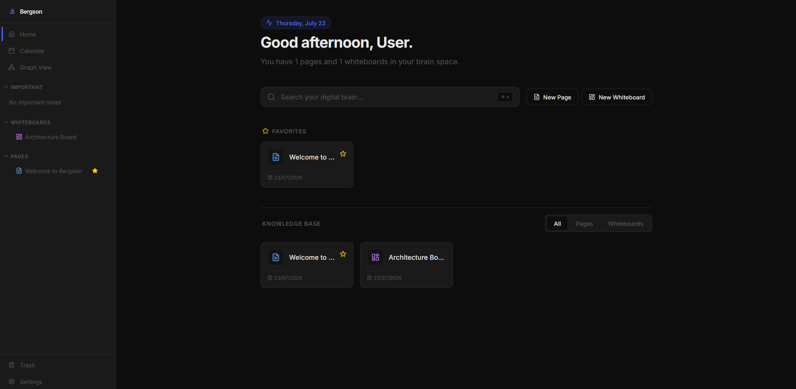

# 🚀 Bergson

**Bergson** is a privacy-focused, local-first digital brain. It combines the structured power of a block-based text editor, the analytical strength of mini-database tables, and the freeform flexibility of an infinite whiteboard canvas. All your thoughts, notes, and diagrams stay entirely on your device.


---

## ✨ Features (v0.4.0)

### 📝 Block-Based Editor (Pages)
- **Notion-Style Blocks:** Write fluidly with support for Text, Headings (H1-H3), Lists (Bullet/Numbered/Todo), Quotes, Code Blocks, and Dividers.
- **Notion-Style Hierarchy (Nested Pages & Whiteboards):** Drag-and-drop any Page or Whiteboard under another document to create infinite nested document trees.
- **Drag & Drop Reordering:** Grab blocks by a handle and move them effortlessly.
- **Rich Text Formatting:** Bold, Italic, Strikethrough, and inline Code.
- **Slash Commands (`/`):** Quickly insert blocks without taking your hands off the keyboard.
- **Bi-directional Linking (`[[`):** Type `[[` to instantly search and link to other pages. The bottom of each page automatically tracks and displays **Backlinks** to show where it was referenced.
- **Kanban Boards:** Organize your tasks visually with interactive, drag-and-drop Kanban columns directly inside your text editor.
- **Drag & Drop Images:** Seamlessly insert images with a built-in cropping tool.
- **Internal Page Links:** Type `/link` to embed shortcut cards to other pages.
- **Export to PDF:** Save your pages directly as beautifully formatted PDFs.

### 📊 Mini-Database Tables
- **3x3 Matrix Defaults:** Newly created tables initialize cleanly with 3 columns and 3 rows.
- **Middle Column & Row Insertion:** Insert columns in the middle of a table with 1-click `+` hover buttons or column header dropdown menus.
- **Typed Columns:** Convert any table column to Text, Number, Date, Checkbox, or Tag.
- **Calculations Footer:** The bottom of your tables will automatically sum Number columns or count Text columns.
- **Sorting & Resizing:** Easily sort ascending/descending, and drag the column headers to resize them horizontally to fit your content.
- **Flexible UI:** Operates seamlessly whether in standard or full-width mode.

### 📅 Calendar, Journaling & Organization
- **Calendar Integration:** A built-in visual calendar tracks the days your pages were created, perfect for daily journaling.
- **Deadlines:** Tag any page with `#deadline-YYYY-MM-DD` (e.g., `#deadline-2024-12-31`) to make it appear as a high-priority marker on the calendar.
- **Tags, Status, & Icons:** Personalize your pages with emoji icons, status trackers (e.g., *In Progress*, *Done*), and custom #tags.

### 🎨 Infinite Whiteboard
- **Infinite Canvas:** Pan (using spacebar or empty-click) and zoom without boundaries.
- **Drawing & Shapes:** Pencil, Eraser, Rectangle, Circle, and Line tools.
- **Sticky Notes & Text:** Easily annotate diagrams with colorful sticky notes and raw text blocks.
- **Smart Arrows:** Connect shapes, sticky notes, and page links with arrows that automatically snap and follow objects when they are moved.
- **Smart Bookmarks:** Paste URLs to auto-generate beautiful bookmark cards with titles and links (via Microlink).
- **Interactive Routing:** Place links to your internal `Pages` directly on the whiteboard to create visual mind-maps of your notes.
- **Export:** Download your entire whiteboard canvas as a high-resolution PNG image or a PDF document.

### 🏠 Focused Home Dashboard
- **Knowledge Base Filters:** Quickly isolate Pages vs. Whiteboards with a single click.
- **Instant Search:** Search across your entire digital brain with `⌘K` or the home search bar.
- **Time-Aware Greeting & Stats:** Personalized welcome screen displaying your current digital brain metrics.

### 🌓 Customization & Theming
- **Dynamic Themes:** Light Mode, Dark Mode, and System Default support.
- **Color Accents:** Personalize the app with 5 vibrant accent colors.
- **Typography:** Choose between Sans-serif, Serif, and Monospace fonts.
- **Layout Preferences:** Toggle between Centered reading mode and Full-Width editor mode.

### ⚡ Performance & Memory Optimization
- **Code-Splitting & Vendor Chunking:** Dynamic React route loading (`React.lazy`) and manual Rollup chunking reduce initial bundle size by ~97% down to **60 kB** main bundle.
- **LRU Memory Cache & Blob Revocation:** In-memory LRU media cache automatically revokes Blob URLs (`URL.revokeObjectURL`) to maintain low RAM usage during long sessions.
- **Regex Storage Cleanup:** High-speed regex scanner detects and purges orphaned images and orphaned blocks before local exports and cloud backups.

### 🔒 Data, Storage & Cloud Sync
- **100% Offline (Local-First):** Your data is stored securely in your browser using Dexie.js (IndexedDB).
- **Google Drive Auto-Backup & Silent Auth:** Automatic background cloud backups to Google Drive (`appDataFolder`) with silent token refresh.
  > 💡 **Google Cloud Setup Note:** For self-hosting or deployment, it is recommended to create your own OAuth 2.0 Client ID in [Google Cloud Console](https://console.cloud.google.com/) (with Google Drive API enabled and `https://www.googleapis.com/auth/drive.appdata` scope) and update `CLIENT_ID` in `src/services/googleDriveSync.ts`.
- **Manual Data Export/Import:** Backup your workspace manually into a single `.json` file.
- **Storage Metrics & Cleanup:** Monitor local storage usage and run 1-click cleanup to purge unused media.

---

## 🛠 Tech Stack
- **Framework:** React 19 + Vite 8
- **Styling:** Tailwind CSS + Radix UI Primitives
- **Database:** IndexedDB (via Dexie.js)
- **Canvas/Whiteboard:** Fabric.js
- **State Management:** Zustand

## 🚀 Quick Start (Development)

1. Clone the repository
```bash
git clone https://github.com/nmfel/bergson.git
cd bergson
```

2. Install dependencies
```bash
npm install
```

3. Run the development server
```bash
npm run dev
```

4. Build for production
```bash
npm run build
```

*(Note: If deploying to Vercel, a `vercel.json` is included to handle React Router SPA rewrites).*
